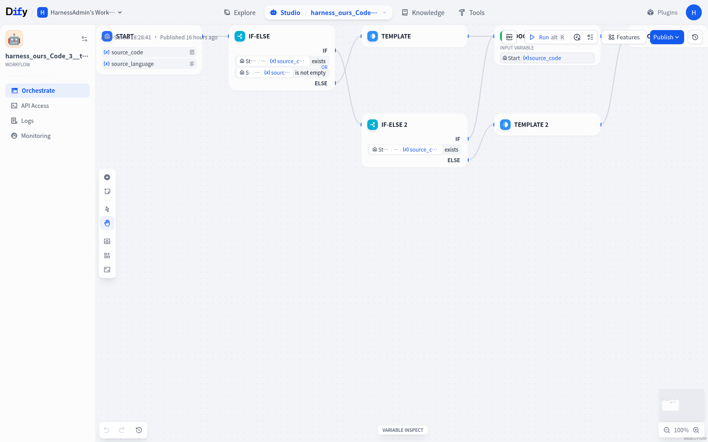

# WorkflowIR Harness

[中文主页](README.md) · [English](README_EN.md)


> 面向复杂配置生成任务的轻量 Agent + 确定性 Harness：不依赖通用 Coding Agent，生成可导入、可执行、可验证的 Dify 工作流。

## 48 组配对输入、96 次系统运行：不是单个幸运样本

**16 类公开任务 × 3 组固定输入 × 2 套系统 = 96 次系统级运行**，组成 **48 组同输入对照**。同一份冻结配置必须通过全部 3 组输入，才记为一个稳定工作流。


| 方法 | 稳定运行工作流 | 运行通过 | 稳定语义工作流 | 语义通过 |
|---|---:|---:|---:|---:|
| 官方 Agentic 产物 | 10/16 | 32/48（66.7%） | 5/16 | 23/48（47.9%） |
| **WorkflowIR-Harness** | **15/16** | **45/48（93.8%）** | **9/16** | **34/48（70.8%）** |

全部 19 个 Harness 工作流中，18/19 连续通过 3 组运行输入；Harness 侧共 57 次系统运行，其中 54 次通过（94.7%）。剩余 3 次保留为 **StudyPlanner_3** 超时，没有从结果中删除。

## 代表案例：语义通过 0/3 → 3/3，生成 Token 减少 29.8%

在相同模型、关闭思考、相同 **Mermaid_2** 两轮需求下：

~~~text
生成 Token
OpenCode Agentic    ████████████████████  35,457
WorkflowIR-Harness  ██████████████        24,877  ↓ 29.8%

语义成功
OpenCode Agentic    ░░░  0/3
WorkflowIR-Harness  ███  3/3（100%）
~~~

| 方法 | 生成 Token | 模型调用 | Dify 执行 | 语义成功 |
|---|---:|---:|---:|---:|
| OpenCode Agentic | 35,457 | 2 | 3/3 | 0/3 |
| **WorkflowIR-Harness** | **24,877** | 5 | 3/3 | **3/3** |

Harness 虽然进行了更多次模型调用，但每一步只携带必要上下文，因此总生成 Token 更低。OpenCode 产物能够运行，却把知识总结与 Mermaid 源码混入同一变量；Harness 通过显式输出契约得到 3/3 语义成功。

> 这是同任务的选定工程案例，不是总体 Token 均值，也不是官方排行榜成绩。生成 Token 不包含 Dify 运行工作流时的业务模型消耗。完整记录见[案例复盘](docs/CASE_STUDY_MERMAID2.md)。

## 它解决什么问题

直接让大模型一次性生成完整 Dify DSL，既要理解需求，又要记住大量 Node Schema、变量引用和边连接规则。配置一旦变长，常见失败包括：

- 边没有指向有效节点，或 Router 分支缺少出口；
- 节点存在，但输入变量引用了不存在的上游输出；
- 拓扑合法，却无法被 Dify 导入或实际执行；
- 每次失败都重新生成整份大 JSON，Token 多且修复方向不明确。

WorkflowIR Harness 将“自然语言生成复杂配置”改造成一条有边界的闭环：

```text
Requirement Rewrite
        ↓
Candidate Retrieve & Progressive Schema Disclosure
        ↓
Graph Plan → Parameter Bind
        ↓
Typed Workflow IR
        ↓
Deterministic Validate
        ↓
Dify Adapter → Import → Real Execution
        ↓
Trace-based Repair / Success Memory
```

## 核心设计

### 1. 用 Workflow IR 缩小生成空间

模型首先生成类型化 Workflow IR，只表达节点、边、分支和变量映射；Dify 中体积庞大的平台字段由 Adapter 确定性补齐。模型负责语义规划，程序负责平台配置，从而避免同时完成“任务理解、拓扑规划和大 JSON 填充”。

### 2. 按阶段披露上下文

系统不会把原始多轮对话和全部 Node Schema 一次性塞给模型。需求先被压缩为 Requirement Spec；检索阶段确定候选节点后，只披露入选节点的完整 Schema。这样既保留企业自定义 Node/API 的描述，又减少无关配置对 Builder 的干扰。

### 3. Router 感知的图生成

遇到条件需求时，系统显式生成 Router、Branch Spec 与汇聚契约，而不是把所有步骤压成一条线。共享输入只定义一次，各分支独立生成子图，再通过变量聚合节点收敛。

### 4. 分层验证，不把所有失败都交给重试

| 错误层 | 典型问题 | 处理方式 |
|---|---|---|
| Graph | 空边、孤立节点、非法连接、Router 分支不完整 | 回退并重建拓扑骨架 |
| Binding | 变量不存在、上下游类型不一致、必填输入缺失 | 仅重绑失败节点 |
| Execution | 配置合法但 Dify 运行报错 | 根据 Trace 定位节点，人工确认后局部修复 |

每次修复后重新执行全图校验；连续失败或节点规模超过能力边界时停止自动重试，避免无上限消耗。

### 5. 成功经验池是运行时能力，不是测试答案库

通过真实执行与断言的工作流才能进入经验池。经验只保留去参数化的节点类型、边结构和失败—修复摘要，并按任务类别隔离；检索结果只是生成先验，仍必须通过同一套验证与执行流程。

首版无经验池结果与自进化版本分开报告，避免把 benchmark 的目标答案或未来样本写回经验池造成数据泄露。

## 真实 Dify 工作流：不是只验证 JSON

下面是 Harness 生成并导入 Dify 的真实 14 节点工作流。它包含嵌套路由、子图汇聚、确定性处理、双修复路径和有界兜底，而不是简单的 `Start → LLM → End` 线性拓扑。



完整演示将画布、运行结果和节点 Trace 放在同一条证据链中：


- Dify 成功导入并运行工作流；
- 日志状态为 `SUCCESS`；
- 可查看每个实际执行节点的耗时与输出；
- 最终结果通过任务级断言，而不只检查配置文件能否解析。

## 如何判定“成功”

一个 Trial 只有同时满足以下条件才记为通过：

1. **结构有效**：节点、边、Router 与 Merge 满足图约束；
2. **引用有效**：节点输入能够解析到合法的上游变量；
3. **平台有效**：Adapter 生成的 DSL 能被 Dify 导入；
4. **真实执行成功**：Dify 运行状态成功，没有未处理的节点异常；
5. **任务结果有效**：输出满足该任务的关键能力、依赖关系和结果断言。

因此，“LLM 返回了一份 JSON”不等于成功，“Dify 接受了 DSL”也不等于成功；只有工作流真正完成目标才计入通过率。

## 评测设计

### 评测对象

- **Agentic 基线**：把 benchmark 任务交给通用 Coding Agent 生成并修复工作流；
- **WorkflowIR Harness**：Requirement Spec → Workflow IR → Dify Adapter → 分层校验与定向修复。

### 任务规模

当前实验覆盖 **16 类工作流任务**，包括线性生成、条件路由、多分支汇聚、结构化转换、文档/代码输入处理、模板输出、变量聚合和失败兜底等结构。每类任务固定运行 3 次，两套系统接收同一任务说明与验收条件。

### 主要指标

| 指标 | 回答的问题 |
|---|---|
| 可导入率 | 配置能否被真实 Dify 接受？ |
| 首次校验通过率 | 不依赖纠错时，生成的图和绑定有多稳定？ |
| 最终可执行通过率 | 在限定修复轮次内，工作流最终能否真正完成任务？ |
| 定向修复成功率 | Graph、Binding、Execution 错误能否被对应策略修复？ |
| 生成 Token | 为获得一个可用工作流，生成阶段消耗多少模型上下文？ |

### 为什么不做 JSON 逐字段匹配

同一个任务可能存在多套等价拓扑，节点 ID、画布坐标和部分平台默认字段也不会影响执行结果。因此评测以关键节点、依赖关系、变量映射、Dify 执行状态和任务输出断言为准，而不是要求生成结果与某一份参考 JSON 完全相同。

## 责任声明

本项目使用来自公开 benchmark 的任务与资产来验证工程方案，但采用的是面向真实可执行性的自定义 Harness，**没有完整遵循官方 benchmark 协议，因此不宣称官方排行榜成绩**。当前结果用于比较两种生成与纠错路径在所选任务切片上的稳定性和生成成本。

依赖 GitHub、TTS 或其他不可控外部服务的任务不混入本地 Dify 主结果；这类任务应在依赖可用时单独报告，避免把外部服务故障记成工作流生成失败。

## 项目定位

WorkflowIR Harness 不是 Dify 的替代品，也不重复实现 Dify 的运行时、调度和插件生态。它关注的是 Dify 之前最容易失控的一层：

> **如何把自然语言需求稳定地变成可导入、可执行、可验证的复杂工作流配置。**

Dify 负责运行工作流；Harness 负责限制生成空间、验证配置、解释错误并闭环修复。

---

如果你只想快速查看真实案例，请从 [`examples/code3-demo`](examples/code3-demo/) 开始。
