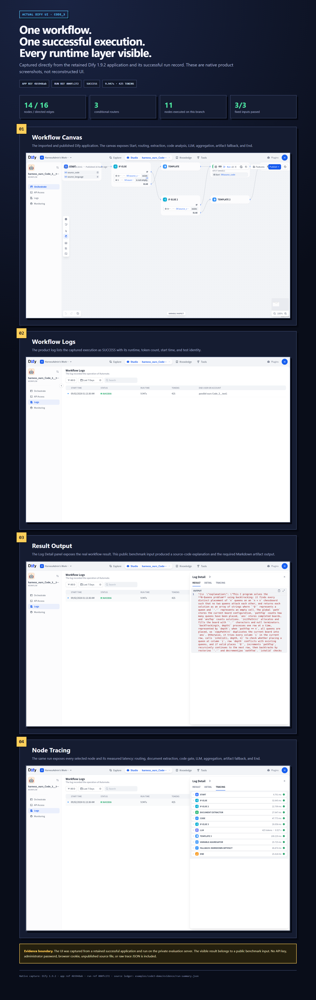
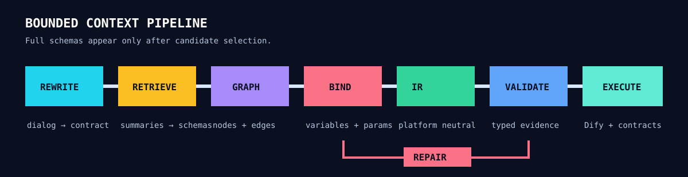
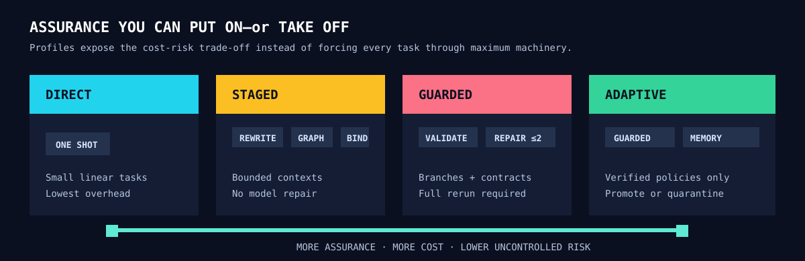
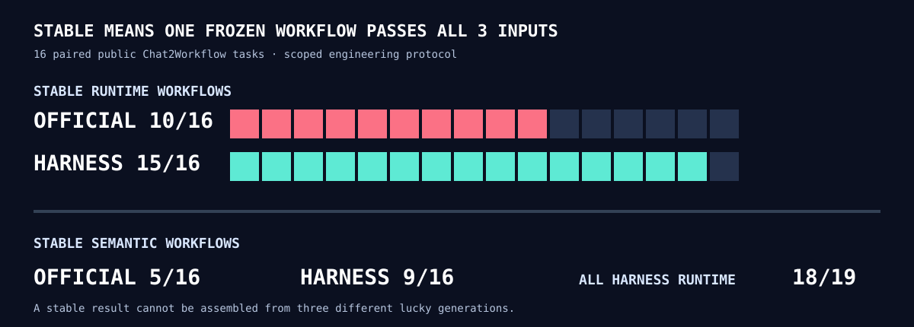

# WorkflowIR-Harness

**Less context. More stable workflows.**

WorkflowIR-Harness is a domain-specific generation and assurance pipeline for bounded visual-workflow configuration. It explores a simple question: when the node catalog, schemas, graph rules, and execution contracts are known, do we still need a general-purpose coding agent?

## End-to-end executable demo

The [Code_3 executable demo](examples/code3-demo/README.md) follows one frozen 14-node, 16-edge workflow through the actual Dify Canvas, Workflow Logs, Result panel, and per-node Tracing view. The captured application is published, its selected run is marked SUCCESS, and the same frozen artifact passed all three fixed inputs.

## Selected case: 29.8% fewer generation tokens

On the same two-round **Mermaid_2** task, with the same model and thinking disabled:

| Method | Generation tokens | Model calls | Dify execution | Semantic success |
|---|---:|---:|---:|---:|
| OpenCode Agentic | 35,457 | 2 | 3/3 | 0/3 |
| WorkflowIR-Harness | **24,877** | 5 | 3/3 | **3/3** |

WorkflowIR-Harness processed **29.8% fewer generation tokens despite making more model calls**. The difference came from smaller stage-specific contexts and an explicit output contract. The OpenCode artifact executed, but mixed the knowledge summary with Mermaid source instead of returning clean **summary** and **mermaid_code** outputs.

> This is a selected, same-task engineering case study—not an aggregate token claim or an official leaderboard result. See the [full trace and accounting](docs/CASE_STUDY_MERMAID2.md).

## Why a specialized generator?

General coding agents are built for an open action space: files, shell commands, dependency discovery, and arbitrary edits. A workflow configuration has a narrower structure:

- a bounded node catalog;
- typed node schemas;
- explicit graph and variable-reference rules;
- a platform adapter;
- observable import errors, node traces, and output contracts.

WorkflowIR-Harness uses those boundaries directly. It does not claim that coding agents are unnecessary for open-ended software work; it tests whether they are unnecessary overhead for this class of configuration task.

## Method

The generator separates five responsibilities:

1. **Rewrite** compresses conversation history into a confirmed requirement contract.
2. **Retrieve** selects candidate nodes from summaries and discloses full schemas only when binding.
3. **Graph** plans nodes, edges, branches, and merge structure without platform serialization noise.
4. **Bind** resolves variables and node parameters into Workflow IR.
5. **Validate** classifies failures and chooses the smallest safe repair scope.

Graph failures trigger topology regeneration. Binding failures rebind the affected node. Runtime failures use the failing node trace. Every repair is followed by a complete workflow rerun; infrastructure failures are recorded separately rather than blamed on generation.

## Progressive assurance

The harness is deliberately removable:

| Profile | Intended use | Enabled path |
|---|---|---|
| **direct** | Small linear configurations | One-shot generation |
| **staged** | Moderate configurations | Rewrite → Retrieve → Graph → Bind |
| **guarded** | Branching or contract-heavy workflows | Staged generation + typed validation and repair |
| **adaptive** | Repeated task families | Guarded path + evidence-gated repair memory |

A simple employee lookup passed with 9,040 tokens through direct generation and 10,626 through staged generation. The complex Mermaid case favored the guarded path. This is why the project treats assurance as a profile, not as a mandatory pile of constraints. Automatic profile selection remains future work.

## 48 matched test instances, 96 system trials — stable workflows, not lucky samples

A workflow is **stable** only when the same frozen configuration passes all three fixed functional inputs. This is the primary engineering signal: one successful sample is not enough.

The paired study evaluates **16 public Chat2Workflow tasks × 3 fixed inputs × 2 systems = 96 system trials**, organized as **48 matched pairs**. Task-level stability still requires one frozen workflow to pass all three inputs:

| Method | Stable runtime workflows | Runtime acceptance | Stable semantic workflows | Semantic success |
|---|---:|---:|---:|---:|
| Official Agentic artifacts | 10/16 | 32/48 (66.7%) | 5/16 | 23/48 (47.9%) |
| WorkflowIR-Harness | **15/16** | **45/48 (93.8%)** | **9/16** | **34/48 (70.8%)** |

Across all 19 harness workflows, 18/19 passed all three runtime inputs; 54/57 harness system trials passed runtime acceptance (94.7%). The remaining three trials were retained as **StudyPlanner_3** timeouts.

The tasks originate from the public [Chat2Workflow](https://github.com/zjunlp/Chat2Workflow) benchmark, but this project intentionally uses a different engineering protocol. Runtime-visible import errors, node traces, and output-contract violations may guide bounded repair. Ground-truth workflows and judge answers are never exposed to generation or repair. See [Evaluation protocol](docs/EVALUATION.md) and [Claims and limitations](docs/CLAIMS_AND_LIMITATIONS.md).

## Failure is evidence, not another lottery ticket

The engineering loop is:

~~~text
generate → validate → execute → classify → bounded repair → full rerun
~~~

It does not repeatedly sample until one workflow happens to pass. A failed attempt must produce a typed issue and an auditable next action. The optional experience pool stores verified repair policies—not task answers—and promotes a policy only after whole-workflow success.

## Package layout

~~~text
src/workflowir_harness/
├── domain.py       # requirement, workflow, issue, and outcome types
├── profiles.py     # direct / staged / guarded / adaptive modes
├── telemetry.py    # call-level and success-normalized token accounting
└── pipeline.py     # provider-independent staged orchestration

src/                # existing Dify adapter, validators, runner, and repair memory
tests/              # offline, runtime-policy, and pipeline self-tests
docs/               # method, case study, evaluation, and claim boundaries
~~~

The new package is intentionally thin and provider-independent. Existing experiment scripts remain available while they are migrated behind stable interfaces.

## Quick start

~~~bash
python -m venv .venv
source .venv/bin/activate
pip install -r requirements.txt

PYTHONPATH=src python tests/pipeline_selftest.py
PYTHONPATH=src python tests/offline_selftest.py
PYTHONPATH=src python tests/experience_pool_selftest.py
~~~

To run the Dify execution harness, provide a private admin environment file and the upstream evaluation assets:

~~~bash
export DIFY_ADMIN_FILE=/secure/path/dify_admin.env
export BENCH_CHECK_FILE=/path/to/check_pass_stage.json
export BENCH_CASE_FILES=/path/to/case_files

PYTHONPATH=src python src/run_dify_all3.py \
  --arm staged \
  --workers 5 \
  --result-dir results/run
~~~

Secrets, raw traces, user content, and local absolute paths are excluded from the repository.

## Reproducibility

- [Mermaid_2 case study](docs/CASE_STUDY_MERMAID2.md)
- [Scoped evaluation protocol](docs/EVALUATION.md)
- [Claims and limitations](docs/CLAIMS_AND_LIMITATIONS.md)
- [Expanded runtime evaluation](docs/EXPANDED_RUNTIME_EVAL.md)
- [Bad cases and repair decisions](docs/BAD_CASES_AND_REPAIRS.md)
- [Runtime experience pool](docs/RUNTIME_EXPERIENCE_POOL.md)
- [Compact trial ledger](docs/expanded_trials.json)

## Acknowledgement

The public tasks, node-catalog fixture, and official comparison artifacts originate from [Chat2Workflow](https://github.com/zjunlp/Chat2Workflow), *A Benchmark for Generating Executable Visual Workflows with Natural Language*. WorkflowIR-Harness is an independent engineering extension and is not affiliated with the benchmark authors.

## License

MIT. Upstream assets retain their original notices in [THIRD_PARTY_NOTICES.md](THIRD_PARTY_NOTICES.md).
