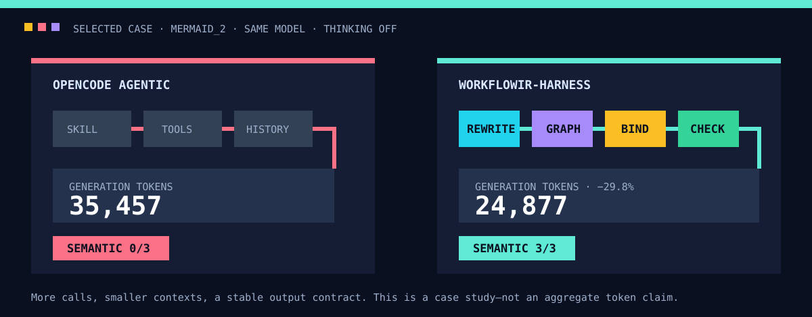

# WorkflowIR-Harness

**更少上下文，更稳定的工作流。**

WorkflowIR-Harness面向节点集合、Schema和执行协议确定的可视化工作流配置任务，探索使用领域化生成器与渐进式保障层，替代通用Coding Agent承担全部生成工作的可能性。

## 一个直接结果

在相同模型、关闭思考、相同**Mermaid_2**两轮需求下：

| 方法 | 生成Token | 模型调用 | Dify执行 | 语义成功 |
|---|---:|---:|---:|---:|
| OpenCode Agentic | 35,457 | 2 | 3/3 | 0/3 |
| WorkflowIR-Harness | **24,877** | 5 | 3/3 | **3/3** |

虽然模型调用更多，但分阶段上下文更小，因此总生成Token降低**29.8%**。官方产物能够运行，但将知识总结与Mermaid源码混入同一变量；本项目通过显式输出契约获得3/3语义通过。

> 这是同任务的选定工程案例，不是总体Token均值，也不是官方排行榜成绩。完整记录见[案例复盘](docs/CASE_STUDY_MERMAID2.md)。

## 核心方法

~~~text
多轮需求
  → Requirement Spec
  → 候选Node检索
  → Graph规划
  → 参数绑定
  → Workflow IR
  → 分层校验
  → Dify执行
  → Trace定向修复
  → 全图复验
~~~

- Rewrite压缩上下文并明确输入、输出与业务约束；
- 检索阶段使用Node摘要，Bind阶段才披露入选Node完整Schema；
- Graph与Binding分离，避免拓扑规划和庞大平台参数互相干扰；
- Graph、Binding、Execution、Infrastructure错误采用不同处理策略；
- 失败必须产生明确错误和修复动作，而不是持续抽样直到偶然成功。

## 最重要的评测指标：稳定工作流

同一份冻结配置必须连续通过3组固定输入，才计为一个稳定工作流。

| 方法 | 稳定运行工作流 | 运行通过 | 稳定语义工作流 | 语义通过 |
|---|---:|---:|---:|---:|
| 官方Agentic产物 | 10/16 | 32/48（66.7%） | 5/16 | 23/48（47.9%） |
| WorkflowIR-Harness | **15/16** | **45/48（93.8%）** | **9/16** | **34/48（70.8%）** |

全部19个Harness工作流中，18/19连续通过3组运行输入，总运行通过率为54/57（94.7%）。

评测任务来自公开Chat2Workflow Benchmark，但采用允许运行时反馈参与有界修复的工程协议，不冒充官方提交。生成与修复链路看不到标准工作流和Judge答案。详细口径见[评测协议](docs/EVALUATION.md)。

## 使用

~~~bash
python -m venv .venv
source .venv/bin/activate
pip install -r requirements.txt
PYTHONPATH=src python tests/pipeline_selftest.py
~~~

英文主页包含完整架构、复现方式、经验池设计和责任边界：[README.md](README.md)。
