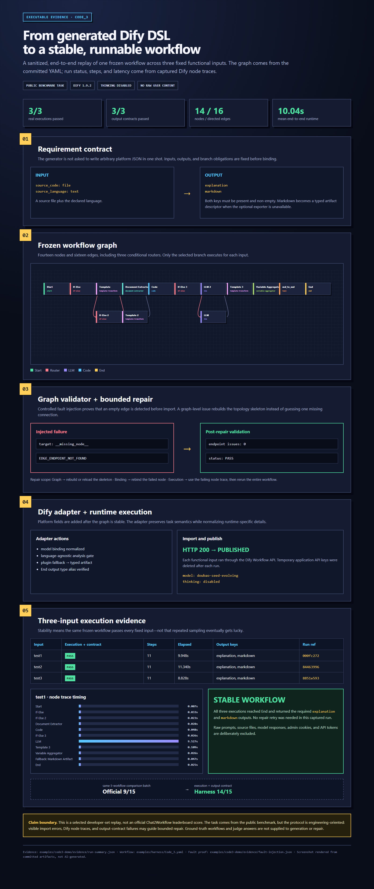

# Code_3 end-to-end demo

This example follows one complex, frozen workflow through the full engineering path:

~~~text
requirement contract -> generated graph -> static validation -> Dify adapter
-> import and publish -> three fixed executions -> output contract
~~~

## What is real in the screenshot

- The graph is rendered from [Code_3.yaml](../harness/Code_3.yaml): 14 nodes, 16 directed edges, and three conditional routers.
- The execution table is extracted from a captured Dify 1.9.2 run. The same frozen workflow passed test1, test2, and test3 with the required explanation and markdown outputs.
- The node timing chart comes from the captured Dify node-execution trace.
- The empty-edge failure is a controlled, reproducible injection against the committed graph. The validator reports EDGE_ENDPOINT_NOT_FOUND, then the original frozen skeleton passes endpoint validation.

The public evidence is sanitized. It contains no source files, prompts, model responses, administrator cookies, API tokens, or raw traces.

## Files

- [Complete flow screenshot](screenshots/code3-complete-flow.png)
- [Browser report](report.html)
- [Sanitized run ledger](evidence/run-summary.json)
- [Graph failure proof](evidence/fault-injection.json)
- [Evidence builder](build_demo.py)

## Rebuild

With the committed sanitized summary:

~~~bash
python examples/code3-demo/build_demo.py
~~~

To refresh the summary from a private Dify runner result:

~~~bash
python examples/code3-demo/build_demo.py --raw-result /private/path/result.json
~~~

The builder reads the private result but only writes the allow-listed summary fields. Capture report.html at a 1520-pixel viewport to reproduce the committed image.

## Evidence boundary

Code_3 originates from the public Chat2Workflow task set, but this repository uses a custom engineering protocol. Runtime-visible import errors, node traces, and output-contract failures may guide bounded repair. This is a selected developer-set replay, not an official leaderboard submission.
